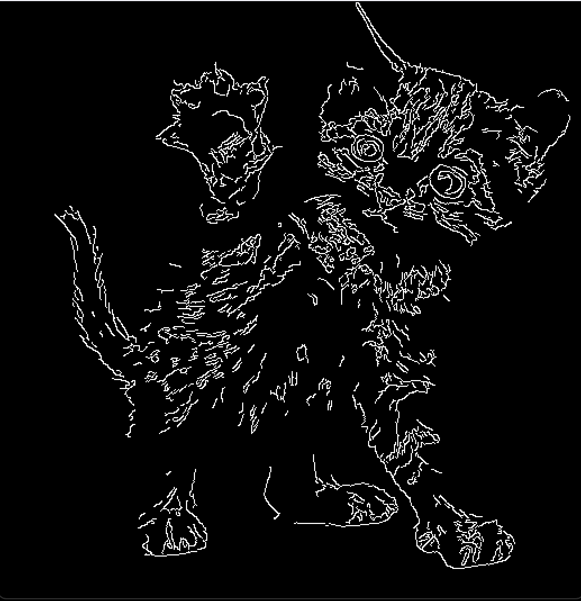

# 컴퓨터비전 학습

이 프로젝트는 컴퓨터 비전에 관심이 생겨서 OpenCV를 이용해서 기본 이미지 표시와 에지 검출 기능을 구현했습니다.

## 프로젝트 파일 구조

### 1. `test.py`
이미지를 불러와 화면에 표시하는 테스트 프로그램입니다.

- **사용 라이브러리**: OpenCV
- **기능 설명**:
  - `cv2.imread`를 통해 지정된 경로의 이미지를 불러옵니다.

---

### 2. `edge-detection.py`
불러온 이미지의 에지를 검출하여 표시하는 프로그램입니다.

- **사용 라이브러리**: OpenCV
- **기능 설명**:
  - 이미지를 불러와 그레이스케일로 변환합니다.
  - `cv2.Canny` 함수를 사용해 Canny Edge Detection을 수행합니다.
    - 하한 임계값 (`lowerThreshold`)과 상한 임계값 (`upperThreshold`)을 설정하여 에지 검출 강도를 조절합니다.
  - 검출된 에지 이미지를 화면에 표시하며 키 입력이 있을 때까지 대기 후 창을 닫습니다.

---

### 3. `GAN.py`
GAN을 활용한 스타일 전이(Style Transfer)를 수행하는 프로그램입니다.

- **사용 라이브러리**: TensorFlow, Keras, Matplotlib
- **기능 설명**:
  - 에지 이미지에 스타일 전이를 해보고 싶다는 생각에 AI를 활용해서 제작한 프로젝트이며 현재 수정 중에 있습니다.

---

## 프로젝트 실행 화면 (고양이 이미지 에지검출)

  
  

## 사용된 기술 스택

- 
- 
- 
- 
- 
